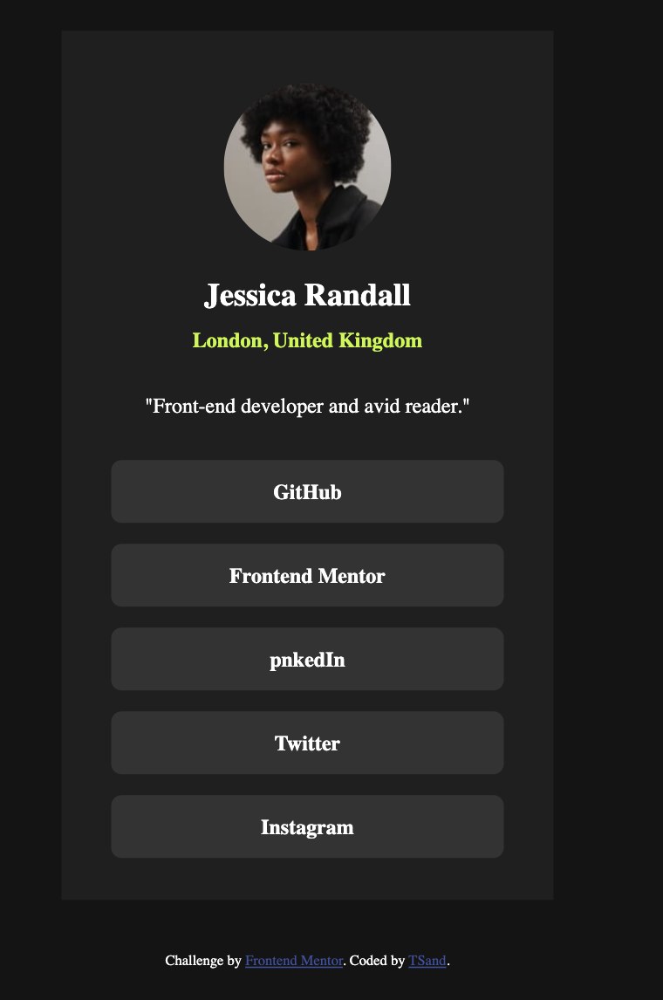

# Frontend Mentor - Blog preview card solution

This is a solution to the [Social links profile challenge on Frontend Mentor](https://www.frontendmentor.io/challenges/social-links-profile-UG32l9m6dQ). Frontend Mentor challenges help you improve your coding skills by building realistic projects. 

## Table of contents

- [Overview](#overview)
  - [Screenshot](#screenshot)
  - [Links](#links)
- [My process](#my-process)
  - [Built with](#built-with)
  - [What I learned](#what-i-learned)
  - [Useful resources](#useful-resources)

## Overview

### Screenshot

### Links

- Solution URL: [https://github.com/Thousand533/Frontend-mentor/tree/main/03-social-links-profile]
- Live Site URL: [https://thousand533.github.io/Frontend-mentor/03-social-links-profile/]

## My process

### Built with

- Semantic HTML5 markup
- CSS custom properties
- Flexbox

### What I learned

### Useful resources

- [Google web.dev](https://web.dev/learn/css/flexbox?hl=zh-tw) - This helped me for search how CSS works.

## Author

